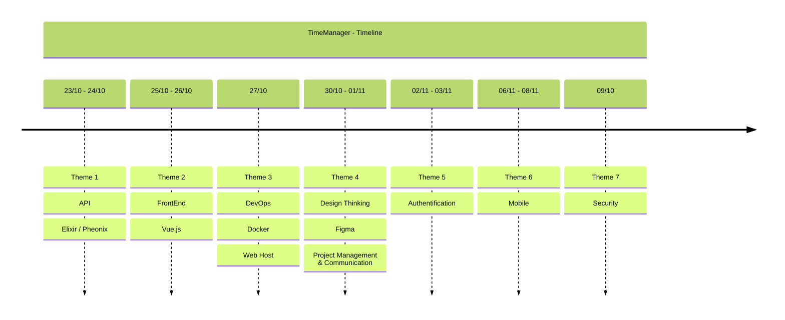

# Time Manager Group 2

  

## Overview

Piscine Msc1 project, Creation of a TimeManager application.

- Context: 
    - There are rising tensions in the corridors of Gotham's town hall due to challenging working conditions, long shifts, and other issues. The main trade union (CGT-U) is alerting the authorities.
- Objective: 
    - To ease the tensions, the town hall decides to implement a time management application that the developers need to create. This application would allow municipal employees to access days off for recuperation.
- Description:
    - The Time Manager project is a web application that helps users manage their time efficiently. It consists of three main services:
        1. **Frontend**: The application's user interface.
        2. **API**: The backend that processes requests and interacts with the database.
        3. **Database**: Stores all the data required by the application.

    - Each of these services is containerized using Docker and orchestrated with Docker Compose for easy deployment and management.

## Table of Content

 - [Collaborator](#collaborator)
 - [Technical Stack](#technical-stack)
 - [Timeline](#timeline)
 - [Project Management](#project-management)
 - [Theme 1 : API](#theme-1--api)
 - [Theme 2 : FrontEnd](#theme-2--frontend)
 - [Theme 3 : DevOps](#theme-3--devops)
 - [Theme 4 : Design Thinking](#theme-4--design-thinking)
 - [Theme 5 : Authentication](#theme-5--authentification)
 - [Theme 6 : Mobile](#theme-6--mobile)
 - [Theme 7 : Security](#theme-7--security)

## Collaborator

- [Maxence Leroy](https://www.linkedin.com/in/maxence-leroy-474489250/)
- [Arthur Trusgnach](https://www.linkedin.com/in/t-arthur/)
- [Bastien Rivart](https://www.linkedin.com/in/bastien-rivart-495675220/)
- [Baptiste Dile](https://www.linkedin.com/in/baptiste-dil%C3%A9-812b501a7/)

## Technical Stack
- Front-End
  - [Vue.js (vue3)](https://github.com/vuejs)
- Back-End
  - [Elixir](https://github.com/elixir-lang/elixir)
  - [Phoenix Framework](https://github.com/phoenixframework/phoenix)
- Deployment
  - [Docker](https://github.com/docker)
- Test
  - [PostMan Collection](./Time%20Manager.postman_collection.json)

## Timeline

## Project Management

To manage organization within the project and track the progress of various tasks, set up a JIRA with ticketing:
- [JIRA](https://timemanagement2.atlassian.net/jira/software/projects/KAN/boards/1)

## Theme 1 : API

See the associated README.md in the directory [API](./api/README.md)

## Theme 2 : FrontEnd

See the associated README.md in the directory [FrontEnd](./frontend/README.md)

## Theme 3 : DevOps

See the associated README.md in the directory [DevOps](./devops/README.md)

## Theme 4 : Design Thinking

See the associated TEMPLATES in your [Figma](https://www.figma.com/file/kXZAlkdy6b2cAzDDwli4hN/Untitled?type=design&node-id=0%3A1&mode=design&t=ZRs1vxDSDq6oaxcz-1)

## Theme 5 : Authentification

## Theme 6 : Mobile

## Theme 7 : Security